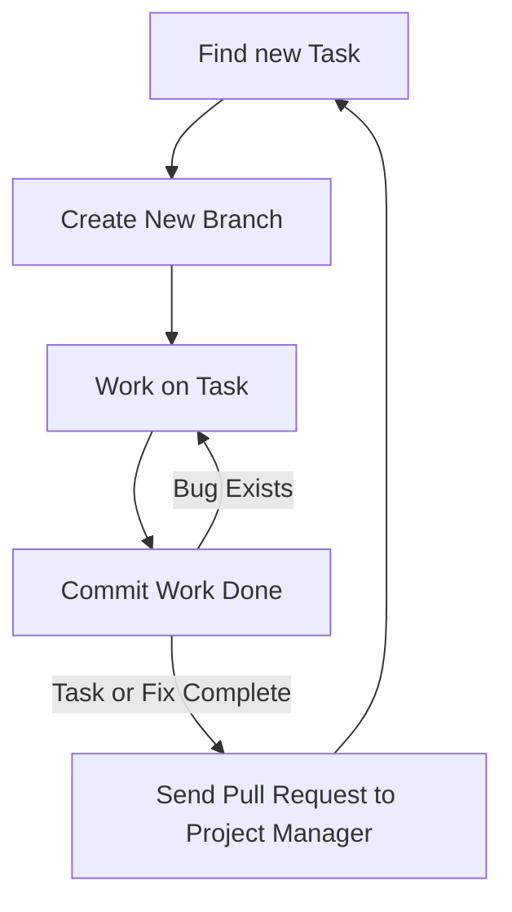

---
# Page title
title: Development Collaboration

# Title for the menu link if you wish to use a shorter link title, otherwise remove this option.
linktitle: Collaboration

# Date page published
date: 2021-03-23

# Academic page type (do not modify).
type: book

# Position of this page in the menu. Remove this option to sort alphabetically.
weight: 4

draft: False

---

One of the most challenging aspects of software development is working effectively as part of a team. This problem is even more pronounced for inexperienced programmers because the way the code is organized will impact how well the team can collaborate. Fortunately we are using Django, so the way our code will be organized has already been decided for us. Django projects are organized to take advantage of OOP and enable effective teamwork. What remains is how team members can share their work together and combine it into a single code base (or project).

There are two ways in which team members can collaborate or work together:

# 1- Synchronous Collaboration

In synchronous collaboration, the collaborating team members would all be online at the same time and work on the same file together. Such collaboration is easily enabled by replit.com and only requires that members share the link to the project they are working on. Replit.com does a good job of allowing team members to change the same file at the same time and communicate in realtime as they do so.

However, such collaboration has limitations:
1. Requires schedule coordination
2. Limited number of collaborators, ideally it makes sense to have 2 work together synchronously.
3. Contribution of members not tracked
4. Might require the availability of at least one experienced team member to succeed.

The main benefit of synchronous communication is **Knowledge Sharing**. The collaborators would work together on problem solving and the less experienced one would be learning greatly from the person they are collaborating with. Synchronous collaboration is similar is essence to eXprogramming.

## How to Use Synchronous Collaboration on Replit.com?

There are two main methods:

1. Create a team repl as part of the [MISCBA team on replit.com](https://replit.com/team/miscba) called a **multiplayer repl**:



then share the repl url from the browser:



2. Alternatively, you can create a regular repl but add collaborators using the share button:



# 2- Asynchronous Collaboration

In asynchronous collaboration, each member of the collaborating team would work on the project in their own time and do not need to interact directly with other team members. Instead, a system is used to manage how each member changes the code of the project and to enable the consolidation of work from multiple members into a single code base. This is by far the most effective and widely used method of collaboration in programming. Currently, the most popular system used to manage synchronous collaboration is git, which is provided by github.com.

Using git, or github will require developers to learn a new tool that might not be easy to learn at first. But once the developers use the tool correctly, it is possible to enable the collaboration of thousands of developers on a single project, as can be seen in the [linux kernal project](https://github.com/torvalds/linux).

There are many options for developers to use Git and GitHub, they all perform the same tasks and enable the same workflows. The simplist is to use [GitHub Desktop](https://desktop.github.com/) to perform basic operations. If you setup VSCode correctly you can even get the features in VSCode itself. We will also use the web interface provided by GitHub for tasks such as merging  and resolving conflicts.

Using github is not sufficient for collaborating effectively. To be effective, the following conditions must be met:
1. Code organized to enable collaboration (Django forces that on the project in the way it organizes the code)
2. Team must agree on a workflow that describes how each member will start work, what to work on, and how to share it when done.
3. All team members must adhere to the workflow when coding for the project.

## Our Workflow

Each team will have their own workflow, and so we will be recommended a workflow for you to use in this course. The workflow is as follows:

**A task** could be creating a new feature or fixing an existing bug. The workflow describes how developers should behave when they work on a task. The main steps are:

{}
 for steps performed on GitHub
 for steps preformed locally on your computer using GitHub Desktop, VSCode, or Git from the command line.
{}

0.  **Pre-requisite:** Clone the project from GitHub to your computer to get the latest copy of the project code on your computer. Select **clone project** on GitHub desktop then search for the project you want to clone under the Github.com tab. You need to do this once to work from your computer. However, you have to periodically run a pull or fetch operation on your computer to get the latest changes that were added to the project on github from other team memebers.





1.  **Find a task or fix to work on:** It is the responsibility of the project manager to ensure that developers can find tasks to work on. These can be found listed on GitHub issues, the ticketing system used for the project, speaking to the project manager, or reading the requirements document. For this course, project managers should coordinate what team members should be working on. I would highly recommend project teams utilize GitHub issues or project management to write down tasks as issues/tickets in GitHub. Developers can also assist by writing issues that can either bew feature suggestions or descriptions of bugs that need to be fixed. We will discuss project management in more detail in [the next section]().

2.  **Create a new branch:** Branches allow a developer to change the code without fear of ruining the project. When starting on a programming task, always create a new git branch for the task from the master branch. A branch allows you to change the code for you only, and not affect the work of others. You need to always remember the following:
   - **NEVER work directly on the master branch, only run fetch/pull to update it on your computer**. 
   - **Create a new branch** from the master branch only.
   - **Choose a name** for the new branch that reflects what work is done. For example bug_1234, where the number is the issue number on github. Or feature_1234. To learn about what characters are allowed in a branch name [please read this article](https://git-scm.com/docs/git-check-ref-format).
   - **The master branch is the responsiblity of the project manager only**, these include:
      - The Master branch **should always** have a working copy of the project, never a broken one. 
      - Ensuring that the master branch is always up to date with the latest changes from all team members. This way team members can get the latest working code by running fetch/pull on their local copy of the master branch.
      - At the end of completing the work on the newly created branch, the project manager will be responsible for merging the branch into the master branch.
   


4.  **Working on the task**: Ensure that the task you are working on is small and simple. If there are large and complex tasks, break them down into smaller tasks. 

5.  **Commit the task**: Upon completion of the task, or reaching a milestone in your work, you must commit the work. This would allow you to create a snapshot of the work you did to be stored in the github history. The advantage of having a commit snapshot is that you can return to this version of the code any time. Therefore, it is recommended to commit frequently and even for small changes. Just make sure when you commit that you write a useful message for the history to know what you did in that commit. You must always commit and test your work and continue to change the code and commit until you are sure that the changes you did are acceptable and the task is complete.
   

6.  **Create a pull request**: If you are sure the task is complete then you need to create a pull request to let the project manager know that your work is ready to be merged to master. To create a pull request you must:
   1. Push/publish your branch to GitHub. This would send all the commits you did to the branch to GitHub. This is done by clicking the push/publish button on GitHub desktop.

   

   2. Create a pull request on GitHub. This is done by clicking the pull request button on GitHub desktop. This would open the pull request page on GitHub in your browser. The project manager then examines the work and can make one of two decision:

      - The work is complete, then the project manager merges the branch to master. This signals the end of the task it the work is now part of the master branch. Anyone who performs a fetch/pull on their local master branch will get these changes in their master.

      - The work is not complete, then the project manager can comment on the pull request and ask the developer to make changes. The developer can then make the changes and commit them to the branch and push the branch again to update the pull request. The project manager can then reexamine the work and decide to merge it or ask for more changes.

   

   

Everyone is expected to follow these steps whenever you work on development projects in this course. It might seem like an overhead at first, and you will not see the benefits right away. However, the goal is to get you to practice how to code as part of a team. So when you start your final project, you will start to see the benefits of this workflow.

## Git and GitHub

Know that the tool we use for asynchronous collaboration is known as **Git**. It allows developers to keep track of all changes done to their projects. It can be used on the developer's computer using the command line or the GitHub desktop application. You can use it without GitHub.

GitHub is the cloud platform hosting Git services. Its a social media platform for developers built around the Git application. Because Git is so useful for developers, it is hosted for on their platform for all to use for free, provided they make their repositories public. You can pay a subscription if you wish to have private repositories. Furthermore, GitHub built a set of project management tools and social coding tools around Git. The issues, classroom, projects, pull requests, and developer profiles are not part of Git, but were added specifically for GitHub and to make coding more social. We will use many of these features to improve collaboration and for project management purposes.

There are numerous terms that you need to be aware of to use Git and GitHub effectively. We summarize them in the following table. The domain determines whether this term is specific to the Git application or has been introduced as part of the additional social features built by GitHub:

### Git and GitHub Terminology

| **Term** | **Domain** | **Meaning** |
| --- | --- | --- |
| **Repo/Repository** | Git | A repository is where the source code and history of all actions and changes done to it resides. A local repo exists on the developer&#39;s computer and is required for the developer to do work. A remote repo is one that exists on another machine. A GitHub repo is hosted on GitHub to make it accessible for other developers and is considered a remote repo to all developers. |
| **Clone** | Git | Creating a local copy of a repo. The copied repo can be either remote or local |
| **Fork** | GitHub | Similar to a clone but it occurs on GitHub servers. A GitHub repo is created as a copy from another GitHub repo. The new repo will have its own project space, including issues, wikis, and discussions. |
| **Commit** | Git | In CVCS, commit is the act of publishing changes, made locally, to the central repo. For Git, it is an instruction for Git to take a snapshot of the code base in its current state. The snapshot is referred to as a revision. Committing the code base would create the revision locally. To transfer the revision to another repository, the local developer must push it, or an external developer must pull it. |
| **Rev/Revision** | Git | A snapshot of the code base taken by the commit command. A revision is represented by a SHA1 string that is unique to that revision. A developer can switch to any previous state of the code base, whether as a whole or as a single file, by referring to the revision number. |
| **Checkout** | Git | An action to revert the code base, a file, or a group of files to a specific revision |
| **Branch** | Git | Creating a named copy of the source code hosted in a repo that allows the developer to experiment and make changes to the source code and commit them to create new revisions. The developer can delete the branch if not satisfied with the work and discard all the revisions made in the branch, or the developer can merge the branch to the master branch, thereby making the new revisions part of the master. |
| **Master branch** | Git | The main branch used to host all code that has been accepted (the master copy). Developers typically do not work directly on the master branch but create alternative branches to work on, then merge accepted code changes to it. Whenever developers need to start with a fresh copy of the code base, they typically branch out of master. |
| **Merge** | Git | Combining the revisions from two different branches is known as merging. It is performed automatically on pulling or pushing branches. The merging can occur smoothly and automatically if the revisions have no conflict. This is known as a fast-forward merge. If the combined revisions are in conflict, then the developer must resolve the conflict in all the files manually, then explicitly perform the merge. |
| **Conflict** | Git | A conflict occurs when two revisions change the same line, and these changes cannot be consolidated. Git will highlight these lines for the developer and include both lines from each revision so the developer can view them side by side and manually combine them. Once all the files with such conflicts are resolved and saved, the developer must manually issue a merge command for Git to accept the conflict resolution. |
| **Push** | Git | An action that would allow the developer to pull revisions from another branch to the branch the developer is currently working on. Only the revisions unique to the branch being pulled from are moved to the working branch. The branches do not have to be on the same repo. The developer can pull a branch from a remote repo. A push cannot be performed if there is a conflict between the working branch and the remote branch. The developer must pull the remote branch first, resolve any conflict, then push the merged revisions. |
| **Pull** | Git | An action that would allow the developer to send revisions to a branch from the branch the developer is currently working on. Only revisions unique to the working branch are sent to the other branch. The branch being pushed to can be on the local repo or a remote repo. |
| **Pull Request** | GitHub | An action popularized by GitHub. To pull from a remote branch, the developer needs to know the address of the remote machine. GitHub streamlined this process by allowing the developer with new revisions to send a request from his/her repo to another repo on GitHub. The repo would include information on the address and branch to pull from. The developer receiving the pull request can view the changes, have a conversation about them, and either accept or reject them. If accepted, the changes are merged to the repo the pull request was sent to. |
| **Upstream** | Git | The chain of remote repositories that the current repo cloned from. Pushing code upstream requires effort, as conflict must be eliminated. Pull requests are typically sent to repos in the upstream. |
| **Downstream** | Git | The network of all repos that have been cloned from the current repo. Code trickles down effortlessly, as the responsibility of resolving conflict is delegated to the developers in the downstream when they pull from the current repo. |

## Review questions

- What is the difference between synchronous and asynchronous collaboration?
- When using replit.com to collaborate with a colleague, are you engaging in synchronous or asynchronous collaboration? Explain why?
- When using GitHub to collaborate and merge the contributions of different developers, is this considered synchronous or asynchronous collaboration? Explain why?
- What is a Git branch? How would it be useful when working with a team of developers?
- When working on a development project, explain what was the workflow that you used as a team to coordinate between each other?
- What is a pull request? What is a conflict? How would you deal with a conflict in a pull request?

## Collaboration Assignment

1. Start forming teams of 2 students and agree who will be the project manager for the team .
2. Use the following link on github classroom to form your team and setup the assignment: 
   [https://classroom.github.com/a/vOWvfACp](https://classroom.github.com/a/vOWvfACp)
3. The assignment is team based, each team member must perform the following tasks using the workflow we explained in class:
   - The project manager must create a README.md. The README.md must include the following:
      - The name of the team members
      - The name of the project manager
      - Commit and push changes to master
   - After repository is created, each team member must create an .md file named after their name. For example, if the team member's name is John Doe, then the file name would be john-doe.md. The file must include the following :
      - A brief introduction about the team member
      - A list of the courses the team member has taken so far
      - A table (it could be of anything)
      - An image (can be any image from google)
      - A link to any website
      - The goal from creating this file is to learn the markdown language and how to use it to create content on GitHub. You can find information on markdown at [https://guides.github.com/features/mastering-markdown/](https://guides.github.com/features/mastering-markdown/)
   - Each team member must (including the project manager) must modify the README.md file to include a link to their file. For example, if the team member's name is John Doe, then the link would be [John Doe](john-doe.md). Include the link next to your name in the README.md file. Note that you should create a branch and commit your changes to the branch, then send a pull request to the project manager to merge your changes to the master branch 
   
   ### Grading
   - The team will receive:
      - 10 pts for creating readme.me file with correct info
      - 30 pts for demostrating all member involvement and have their pull requests merged (based on git history)
   - Each team member will receive:
      - 20 pts for creating their own .md file
      - 20 pts for correctly creating a branch 
      - 20 pts for successfully sending a pull request to the project manager

