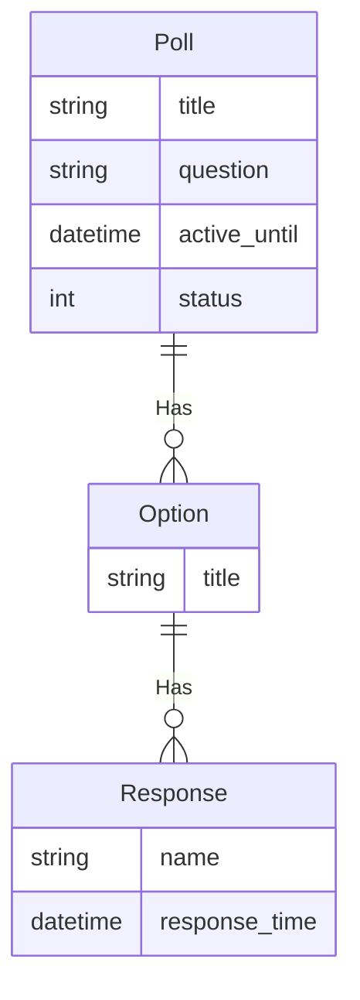

---
# Page title
title: The Poll Project 1st Assignment

# Title for the menu link if you wish to use a shorter link title, otherwise remove this option.
linktitle: Part 1

# Date page published
date: 2021-04-25T11:12:25Z

# Academic page type (do not modify).
type: book

# Position of this page in the menu. Remove this option to sort alphabetically.
weight: 30

draft: False

---

{}
Due Date is <strong>Monday Nov 10th 8am</strong>
{}

You are expected to work as a team on this project. Be sure to follow the workflow that we have explained in class/lab, including the pull request. Part of your assisment will be based on how well you work as a team and use the tools provided by GitHub to collaborate. It will be the responsibility of the project manager to ensure that the team is working together and that the work is distributed fairly.

## Requirements for This Assignments 

- [ ] Setup a new projects named **poll_project**
- [ ] Setup an app named **poll** in your project
- [ ] Edit `.gitignore` by removing the line `db.sqlite3` then save the file. This would allow you to share your database using git (Do this only for the assignment).
- [ ] Create the models for this project based on the ER-Diagram shown below
- [ ] Perform migrations and prepare the database
- [ ] Prepare the admin interface for these model
- [ ] Create a super user named `test` with password `1234`
- [ ] Create some useful test data using the admin interface (3 poll questions with varying number of responses each, from 3 to 7)

### Improve Admin Interface with Following Features:

- [ ] Show poll questions, active date, and status as a list
- [ ] Allow for searching poll questions
- [ ] Filter questions based on status
- [ ] Show Poll option list showing poll question and option
- [ ] Show response name, time, option, and poll for responses.

### ReadMe.md
- [ ] Update the readme file with a section to detail how work was ditributed. The section should include the following:
    - Who was the project manager
    - How work was distributed
    - How the team collaborated
    - Any other information you think is relevant to the project management process

### Bonus Tasks

These tasks will involve reading the Django documentation and figuring out things on your own. Perform these tasks only after you complete the previous requirements of the assignment.

- [ ] In ReadMe.md, create a section named **Bonus** and list all the bonus items you completed in this project. Bonus items will be ignored if not listed on Readme.md
- [ ] In the poll question list, display a column showing the number of responses for the question
- [ ] Create InlineModelAdmin for Poll and Option which allows editing and creating of the question and options in the same form
- [ ] Explore the admin interface on your own and try to implement new features

## ER-Diagram

The ER-Diagram describes the data requirements and will be used for constructing the project's data models in models.py. The blog data model is currently very simple and contains a single entity:

## How to Start and Submit Your Project

1. Join the [poll-project assignment on github classroom](https://classroom.github.com/a/WKTq9ELG).
2. Clone your assignment project using GitHub desktop to your computer and remember to NOT work on the main/master branch except when setting up the project by the project manager. 
3. All tasks must be performed in their own branch and merged to master using a pull request. 
4. When done, commit then push your work using GitHub Desktop. Remember, you can continue to make changes and push code after submission until the deadline.

## Grading Criteria (Total 100 pts, 5% of total grade)

- If submitted project doesn't work, you will receive **10 pts only**
- If submitted project works, breakdown of grades is as follows (Partial credit could be awarded):
    - Proper directory setup **10 pts**
    - Proper model configuration **20 pts**
    - Proper Admin interface setup **30 pts**
    - Proper test data entry **10 pts**
    - Demonstrating proper team work and collaboration **30 pts**
        - Use of pull requests, branching, and proper merging will be checked.
