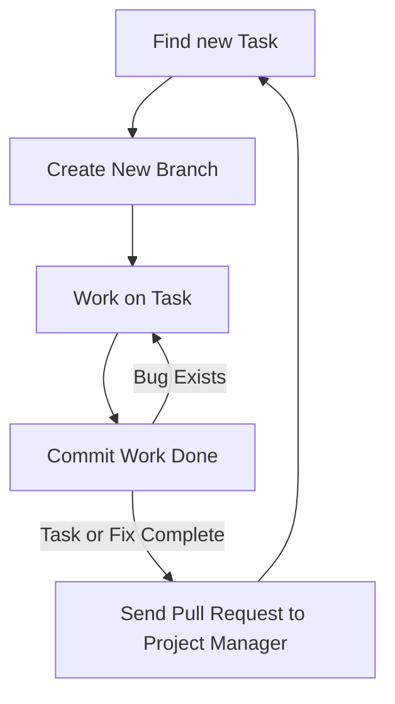

# ISOM 350
## Business Application Development

Mohammad AlMarzouq

Collaboration and Project Management

---

### Two Aspects to Manage in Your Software Project

1. Collaboration 
2. Project Management

---

## Collaboration

- About coordinating between developers
- Ensures their work can be merged/combined into the project successfully
- Will utilize:
  - **Branch** and **merge** features from Git
  - **Pull requests** from GitHub
- Must agree on workflow
  
---

## Collaboration Workflow

1. Developer must always create a **branch** for any new task you work on and **NEVER** work directly on **main** branch
2. Developer must publish branch then create a **pull request** to merge that branch into the **main** branch when they are done
3. Project manager examines the pull request then merges the work to **main** branch
4. The **main** branch must always contain a working and recent copy of the project, so always test it.

---

## Project Management

- Traditionally, it is about completing the project within time and budget
- We are utilizing an agile project management methodology, so:
  - It is about utilizing resources efficiently to make progress in the project
  - There is no **end** in the traditional sense in agile projects and the project is ongoing

---
## Project Management

- More responsibility on project members to self-organize and pick their tasks
- GitHub ticket board is utilized for Project Management
- Project Manager must ensure information on ticket board is correct and up-to-date

---

### Why Use GitHub Project Ticket Board?

- Helps everyone in the team know who is working on what
- Communicates to everyone in the team what the project tasks are
- Communicates progress
- Coordinates work by allowing members to choose to work on tasks no one else is working on

---

## How the Ticketing System Works

- Each ticket represents a task to be completed
- Tickets representing the requirements of the project are placed in a **To-Do** list
- Developers assign themselves a ticket to let the other members know what they are working on and move it to **In-Progress** list

---

## How the Ticketing System Works

- Developer then starts the steps described in the collaboration process and creates a new branch to work on the ticket
- Once done and the pull request is created, the pull request is linked to the ticket and the ticket is moved to the **To-Merge** list
- Project managers merges all the pull requests and moves their corresponding tickets to the **Done** list to track progress.

---

## Types of Collaboration

- Synchronous
- Asynchronous

---

## Synchronous Collaboration

- Developer working together on the same file at the same time
- Enabled using replit.com multiplayer repls
- Great for knowledge sharing
  - A form of eXprogramming

--- 

## Synchronous Collaboration Limitation

- Requires time scheduling
- Limited number of participants (Usually 2)
- Member contribution not tracked

---

## Asynchronous Collaboration

- Developers working together over time
- Enabled using Git and GitHub
  - Integrated with replit.com
- Requires agreement on workflow
- Better fit for large group collaboration and effort tracking

---

## Asynchronous Collaboration Limitations

- Steep learning curve
- Overhead to using the tools
  - Greater benefits with larger groups
  - Still useful for individuals
- Benefit of using collaboration tools might not be clear
- Success dependent on choice from endless workflows

--- 

## Developer Workflow for Our Course

---

## Branches and Pull Requests

- Always create a branch from main/master to start your work
- Once done, create a pull request to ask the project manager to include your work (merge it) to the project
- Discussion can be started around a pull request where manager can ask members to fix problems in their work
- Pull request is completed if it is successfully merged

---



---



---



---

## Git and GitHub

- You need to distinguish between these two
- Git is the tool we use to keep track of the changes made to our source code and combine our work
- GitHub is the cloud platform hosting our git repositories
- GitHub also introduced social coding and project management features to be used with Git

---

## What About Replit?

- Replit is an cloud based IDE
- You use it to write code
- You can pull and push code between it and GitHub

---

## What About Replit?
- When you work alone you pull/import your work to replit.
- When you want your team to see your work you push it to GitHub from replit.
- You work is cloned (i.e., copied) to Replit and another on GitHub
- Each team member gets their own clone of the project code

---

## What If I Cannot Use GitHub?

- Part of your evaluation in this course is based on how well you collaborate through GitHub
- Using Git and GitHub is a very important skill for developers and managers in this age
- You can complete your final project using Synchronous collaboration on replit.com
  - Your grade will suffer from this