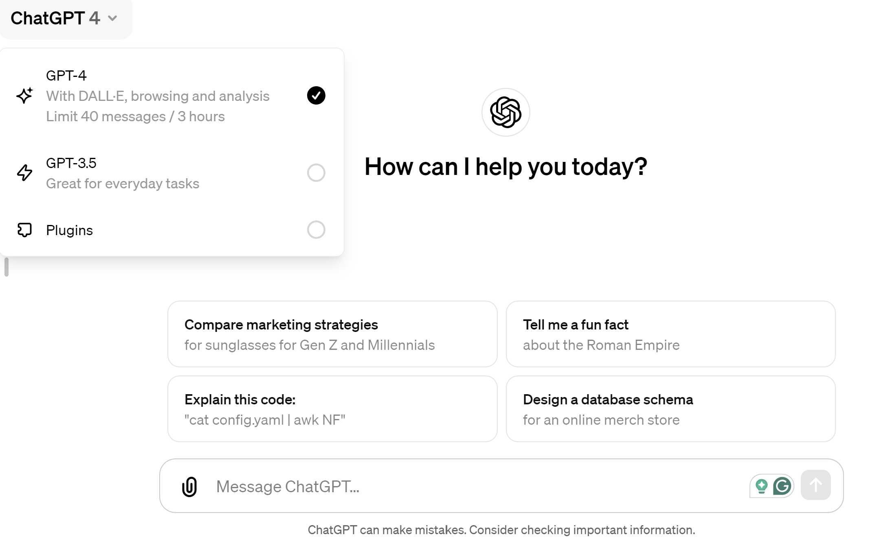

### Prudence in Using AI
#### in Scientific Publishing
##### By Mohammad AlMarzouq

---

## Agenda
- Prudence in 
  - AI Capabilities
  - AI to write research
  - AI in the editorial process
- General advice and lessons learned

---

## Prudence in AI Capabilities 

---

## What is AI?
- Any machines performing tasks that mimic human intelligence
- Machine learning and deep learning are popular subfields of AI
- Processes large datasets for insights
- Evolves with new data

---

### Important Concepts
- Artificial Intelligence (AI)
- Machine Learning (ML)
- Deep Learning (DL)

---

## Artificial Intelligence (AI)
- Broad concept of machines performing tasks in a way that mimics human intelligence.

---

## Machine Learning (ML)
- Subset of AI where machines learn from data without being explicitly programmed for specific tasks.

---

## Deep Learning (DL)
- Advanced subset of ML using neural networks with many layers to analyze data, recognize patterns, and make decisions.

---

## Evolution of Programming 
- Conventional Programming
- Machine Learning Programming
- Deep Learning Programming

---

## Conventional Programming 
- Programmer defines rules and instructions for the computer to follow.
- Data is processed based these rules

---

### Machine Learning Programming
- Programmer trains model
  - Chooses algorithms
  - Provides data 
  - Selects important features
- Models 
  - Learns patterns from data
  - Make predictions

---

### Deep Learning Programming
- Programmer trains model
  - Chooses complex neural network algorithms
  - Provides large dataset 
- Models
  - Learns complex patterns
  - Finds important features
  - Make predictions

---

## What is Causing all this Excitement?
- Deep Learning AI models
- Specifically, Deep Learning models that can produce human-like content
  - These are called Generative AI models
  - They can generate text, images, music, and more
  - ChatGPT is an example

---

## Does AI Think on Its Own?
- No! people might think it does because:
  - Has astonishing capabilities
  - Limited programming effort
    - Mostly training on data
  - Unexplainable black box

---

### Examples of astonishing Capabilities
  - Recognizes complex patterns unseen by humans
  - Utilizes vast data to make insightful or precise predictions
  - Output not distinguishable from human's

---

## However, AI
  - Lacks original creativity 
  - Relies on training data, could be biased
  - Lacks consciousness and self-awareness
  - Lack ability to recognize right from wrong
    - Beware of hallucinations
  - Requires human oversight

---

## Key Takeaways
- Generative AI produces human-like content
- Recombines and generates new content from training data
- Lacks consciousness and creativity
- Requires human oversight

---

## Prudence in AI to Write Research 

---

### You Have Been Using AI for Sometime in Research
- Plagiarism checkers
  - iThenticate, Turnitin, etc.
- Grammar and language checkers
  - Grammarly, Word, etc.
- Translation tools
  - Google Translate, DeepL, etc.
- Search engines
  - Google, Bing, etc.

---

### What Changed?
- AI impact is more observable with Generative AI
- It can now: 
  - Draft research papers and articles
  - Create and refine research questions and outlines
  - Simplify complex explanations
  - Produce and analyze data
  - Summarize papers and reviews
  - Review and edit papers
  - and more 

---

## ChatGPT
- Latest too to have a significant impact

---

## What is ChatGPT?
- Type of generative AI by OpenAI
  - It generates content
- Mimics human-like text responses
- Trained on diverse internet text
  - Based on Deep Learning
- Continuously updated for relevance
  - Latest version is ChatGPT-4

---

## How to Use ChatGPT

---

## How to Use ChatGPT

- Write prompts
  - Describing what you want
  - Give an example of what you want
  - Give document and ask for summary or refinement
- Engage in conversation to refine output
  - Ask to refine output
  - Ask to explain how output is generated
  
---

## Obvious Use Case by Researchers
- Writing paragraphs, sections, or complete papers
- O’Connor, S. & **ChatGPT**. (2023). Open artificial intelligence platforms in nursing education: Tools for academic progress or abuse? Nurse Education in Practice, 66, 103537. https://doi.org/10.1016/j.nepr.2022.103537

---

## Risks
- Will AI Replace researchers?
  - Unlikely to happen given limitations of AI
- Will researchers misrepresent AI-generated content as their own?
  - More likely, content will be unoriginal and not reliable
  - Refining the output likely to take more effort than writing it from scratch
- Will researchers become too reliant on AI?
  - Likely, risk is deskilling and loss of expertise
  - Can be mitigated with guidelines and training

---

## More Productive Uses of AI in Research
- Summarize articles
- Explain or simplify complex concepts
- Analyze or visualize data
- Generate empirical data from documents
- Generate synthetic data for testing models
- Generate/translate research instruments
- Improve wording or paragraph
- Draft outlines and research questions
- and more

---

## Beware of
- Ignoring AI-generated content's need for validation
  - Always validate, experience in subject matter is crucial
- Relying on AI to produce new content
  - It's a tool, not a replacement
  - Write the content, ask AI to refine it
- Not reporting to editors how AI was used in publication
  - We are still trying to understand how AI is used in research
  - Policies and guidelines are still evolving
- Relying on first produced output
  - Engage in conversation to refine output
  - AI as a tool becomes more effective as you learn to use it

---

## Exploring Other Tools
- Elicit
- Consensus
- Researchrabbit
- SciSpace
- Litmaps
- Scite
- Trinka
- Scholarcy
- iThenticate

---

## Key Takeaways
- AI can be a powerful tool in research, that has been used for a while
- New tools like ChatGPT are making AI more impactful
- Other useful tools are available
- AI should complement human expertise, not replace it
- Guidelines on use of AI in research are still evolving

---

## Prudence in AI in the Editorial Process

---

- Role of editorial boards
  - Think about the role of AI in the editorial process
  - Establish guidelines and policies for AI use
    - Transparency will be a minimum requirement
  - Educate authors and reviewers on AI use
- Utilizing AI in the editorial process
  - Assist in screening submissions
    - Avoid over-reliance on AI, likely to reject creative and innovative submissions
  - Enhance peer review process
    - Summarize and compare reviews
    - Use AI as the third reviewer
  - Improve communication language
    - Enhance feedback/reports to be polite and constructive
    - I would advise against using AI to write your reviews
      - Same reasons as using AI to write research

---

# New Challenges

- Undetectable plagiarism
- AI doctored/generated data
- Change in predatory practices
- Possible overwhelming of conventional review process
  - AI generated papers passing initial screening threshold

---
## Solutions
- New tools to detect AI-generated content
- Embrace AI tools and become familiar with their capabilities
- Adoption of Open Science practices
  - Open data, open access, open peer review
- Be transparent about AI use

---

## AI as a Black Box
- Challenges in understanding AI decision paths
- Efforts towards explainable AI
- Balancing trust with transparency in AI systems
- Educating users on AI capabilities and limitations

---

## Conclusion
- AI's potential to transform scientific publishing is immense
- Responsible use and ethical considerations are paramount
- Collaboration between AI and human expertise is key
- Continuous evaluation of AI's impact and evolution

---

### Thank You!
